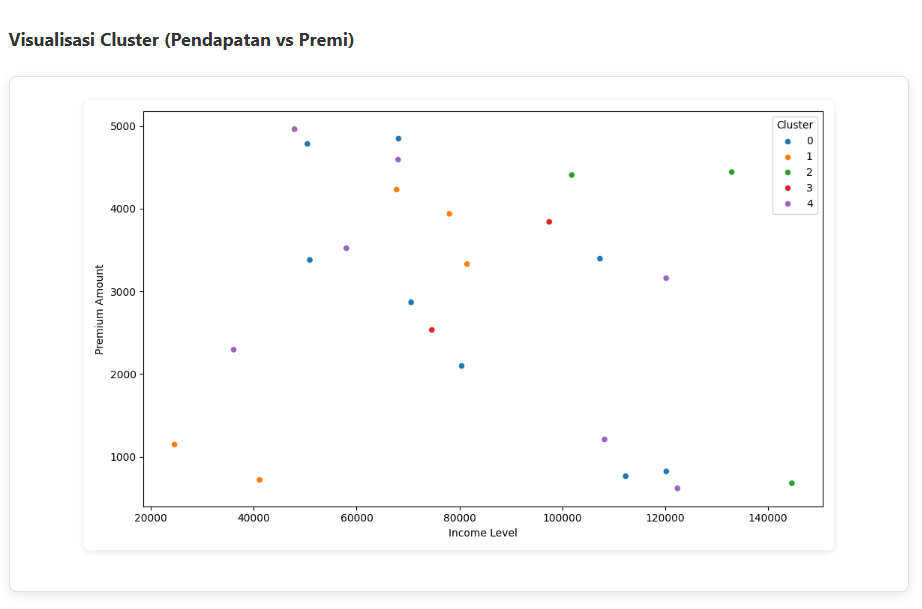
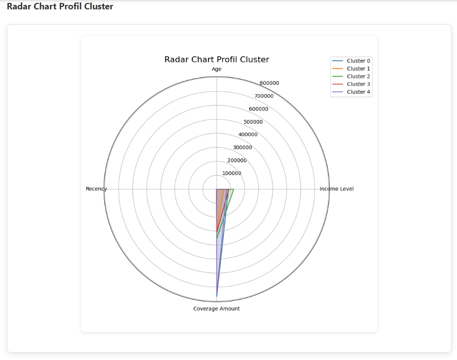
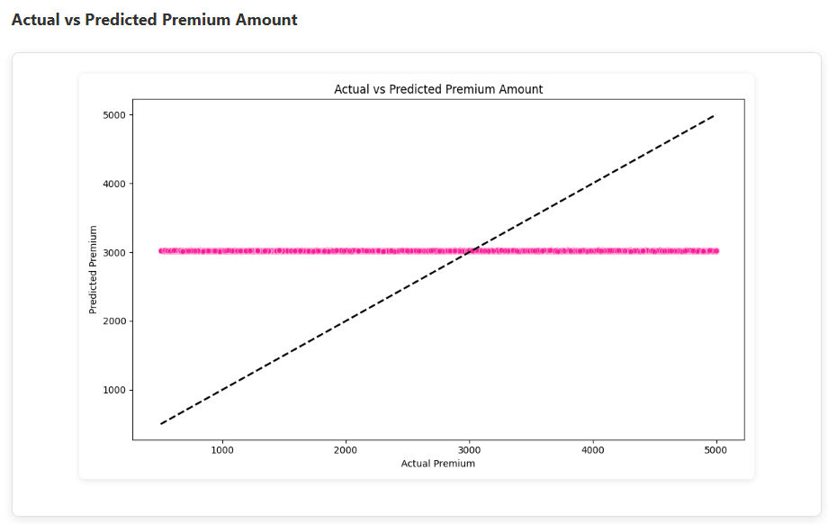

# Analisis Segmentasi dan Prediksi Premi Pelanggan Asuransi

Sebuah proyek Data Mining yang mengaplikasikan teknik Machine Learning untuk menganalisis data pelanggan asuransi, melakukan segmentasi pasar, dan memprediksi premi, bertujuan untuk mendukung strategi pemasaran yang lebih efektif.

## Daftar Isi
- [Tentang Proyek](#tentang-proyek)
- [Fitur Utama](#fitur-utama)
- [Teknologi yang Digunakan](#teknologi-yang-digunakan)
- [Instalasi dan Setup](#instalasi-dan-setup)
- [Penggunaan Aplikasi](#penggunaan-aplikasi)
- [Visualisasi](#visualisasi)
  - [Boxplot Data Numerik](#boxplot-data-numerik)
  - [Visualisasi Cluster (Pendapatan vs Premi)](#visualisasi-cluster-pendapatan-vs-premi)
  - [Radar Chart Profil Cluster](#radar-chart-profil-cluster)
  - [Aktual vs Prediksi Premi](#aktual-vs-prediksi-premi)
- [Struktur Proyek](#struktur-proyek)
- [Anggota Kelompok](#anggota-kelompok)

## Tentang Proyek
Proyek ini merupakan bagian dari tugas besar Data Mining yang berfokus pada penerapan Machine Learning dalam industri asuransi. Kami mengembangkan aplikasi web sederhana berbasis Flask yang mampu melakukan dua tugas utama:
1.  **Segmentasi Pelanggan:** Mengidentifikasi kelompok-kelompok pelanggan yang berbeda berdasarkan karakteristik demografi, perilaku, dan preferensi mereka (menggunakan pendekatan *Unsupervised Learning*: **K-Means Clustering**).
2.  **Prediksi Premi Asuransi:** Memperkirakan nilai premi asuransi yang sesuai untuk pelanggan baru atau potensial (menggunakan pendekatan *Supervised Learning*: **Linear Regression**).

Tujuan utama dari analisis dan aplikasi ini adalah untuk memberikan wawasan yang lebih dalam kepada perusahaan asuransi mengenai profil pelanggan mereka, memungkinkan pengembangan strategi pemasaran yang lebih tepat sasaran, penawaran produk yang personal, dan penentuan harga premi yang lebih akurat.

## Fitur Utama
* **Prediksi Premi:** Input data pelanggan dan dapatkan estimasi premi asuransi.
* **Segmentasi Pelanggan:** Ketahui cluster (segmen) pelanggan tempat individu tersebut berada beserta deskripsinya.
* **Visualisasi Data Interaktif:** Lihat berbagai plot untuk memahami distribusi data, hasil clustering, profil segmen, dan performa model prediksi.
* **Antarmuka Web Sederhana:** Aplikasi web yang mudah digunakan untuk interaksi.

## Teknologi yang Digunakan
* **Python:** Bahasa pemrograman utama.
* **Flask:** Microframework web untuk membangun aplikasi.
* **Pandas:** Untuk manipulasi dan analisis data.
* **NumPy:** Untuk komputasi numerik.
* **Scikit-learn:** Untuk algoritma Machine Learning (K-Means Clustering, Linear Regression, StandardScaler, OneHotEncoder, ColumnTransformer, Pipeline).
* **Matplotlib:** Untuk visualisasi data.
* **Seaborn:** Untuk visualisasi data yang lebih menarik.
* **Joblib:** Untuk menyimpan dan memuat model Machine Learning.
* **HTML/CSS:** Untuk antarmuka pengguna web.

## Instalasi dan Setup

Ikuti langkah-langkah berikut untuk menjalankan proyek ini secara lokal di komputer Anda:

1.  **Kloning Repositori:**
    ```bash
    git clone [https://github.com/your-username/insurance-customer-segmentation-premium-prediction.git](https://github.com/your-username/insurance-customer-segmentation-premium-prediction.git)
    cd insurance-customer-segmentation-premium-prediction
    ```
    *(Ganti `your-username/insurance-customer-segmentation-premium-prediction` dengan URL repositori Anda yang sebenarnya).*

2.  **Buat dan Aktifkan Lingkungan Virtual (venv):**
    ```bash
    python -m venv venv
    ```
    *Di Windows (Powershell):*
    ```powershell
    .\venv\Scripts\Activate.ps1
    ```
    *Di macOS/Linux:*
    ```bash
    source venv/bin/activate
    ```

3.  **Instal Dependensi:**
    ```bash
    pip install pandas scikit-learn matplotlib seaborn numpy flask joblib
    ```
    *(Alternatif, jika Anda membuat `requirements.txt`):*
    ```bash
    pip install -r requirements.txt
    ```

4.  **Siapkan Dataset:**
    Pastikan file dataset Anda (`customer_segmentation_data.csv`) berada di direktori root proyek ini. Anda dapat memperoleh dataset ini dari Kaggle.

5.  **Latih Model:**
    Jalankan skrip pelatihan untuk melatih model Machine Learning dan menyimpannya ke folder `model/`.
    ```bash
    python train_model.py --csv_path customer_segmentation_data.csv
    ```
    *(Pastikan Anda melihat pesan `✅ Model berhasil disimpan ke folder 'model'`)*

6.  **Jalankan Aplikasi Flask:**
    ```bash
    python app.py
    ```
    *(Anda akan melihat pesan `* Running on http://127.0.0.1:5000`)*

## Penggunaan Aplikasi

1.  Buka browser web Anda dan navigasikan ke `http://127.0.0.1:5000`.
2.  Di halaman utama (`Beranda`), Anda dapat mengisi formulir dengan data pelanggan (Usia, Pendapatan Tahunan, Besarnya Pertanggungan, Riwayat Pembelian Terakhir).
3.  Klik tombol "Prediksi Sekarang" untuk mendapatkan hasil cluster pelanggan dan estimasi premi.
4.  Gunakan menu navigasi di bagian atas halaman (Beranda, Boxplot, Cluster Plot, Radar Chart, Actual vs Predicted) untuk melihat berbagai visualisasi data dan analisis model.

## Visualisasi

Aplikasi ini menyediakan berbagai visualisasi untuk memahami data dan kinerja model.

### Boxplot Data Numerik
*Masih Perbaikan*

### Visualisasi Cluster (Pendapatan vs Premi)
*Scatterplot* yang menampilkan bagaimana pelanggan dikelompokkan (clustered) berdasarkan Pendapatan dan Premi. Untuk dataset besar, plot ini menampilkan sampel 25 titik data agar lebih jelas.

*(Ganti `static/cluster_plot.png` dengan path ke gambar visualisasi cluster Anda yang sebenarnya.)*

### Radar Chart Profil Cluster
Menyajikan profil rata-rata untuk setiap cluster berdasarkan fitur-fitur yang digunakan dalam clustering (Usia, Pendapatan, Cakupan, Recency), memungkinkan perbandingan antar segmen.

*(Ganti `static/radar_chart.png` dengan path ke gambar radar chart Anda yang sebenarnya.)*

### Aktual vs Prediksi Premi
*Scatterplot* yang membandingkan nilai premi aktual dengan nilai premi yang diprediksi oleh model regresi, menunjukkan akurasi model secara keseluruhan.

*(Ganti `static/actual_vs_predicted.png` dengan path ke gambar plot aktual vs prediksi Anda yang sebenarnya.)*

## Struktur Proyek
```
.
├── model/
│   ├── kmeans_model.pkl        # Model K-Means yang sudah dilatih
│   ├── reg_model.pkl           # Pipeline model regresi yang sudah dilatih
│   └── scaler.pkl              # Scaler yang sudah dilatih
├── static/
│   ├── png-clipart-health-insurance-health-care-life-insurance... (ikon aplikasi)
│   ├── style.css               # Gaya CSS aplikasi
│   ├── boxplot_data_numerik.png # Contoh gambar boxplot (jika disimpan statis)
│   ├── cluster_plot.png        # Contoh gambar cluster plot (jika disimpan statis)
│   ├── radar_chart.png         # Contoh gambar radar chart (jika disimpan statis)
│   └── actual_vs_predicted.png # Contoh gambar aktual vs prediksi (jika disimpan statis)
├── templates/
│   ├── index.html              # Halaman utama dengan formulir prediksi
│   ├── result.html             # Halaman hasil prediksi
│   └── visualisasi.html        # Halaman untuk menampilkan visualisasi plot
├── app.py                      # Aplikasi Flask utama
├── customer_segmentation_data.csv # Dataset yang digunakan
├── Insurance_Clustering_Regression.ipynb # Notebook Jupyter untuk eksplorasi
└── train_model.py              # Skrip untuk melatih dan menyimpan model
```

## Anggota Kelompok
* Syafarul Priwantoro (1204220018)
* Shafira Daffa Tzabillah (1204220130)
* Angelica Vanniza Arinda (1204220063)
* Auditya Fariz Chrisnadeva (1204220086)
* Cito Julio Ibrahim Kertawirja (1204238073)

